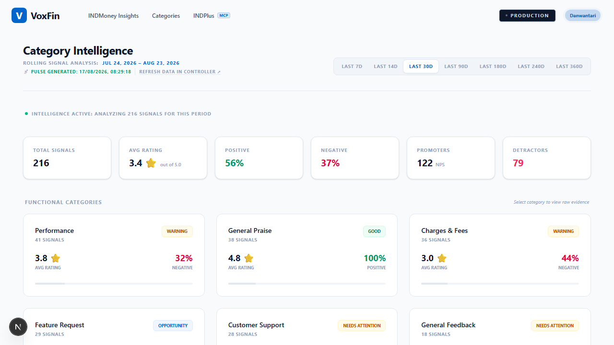
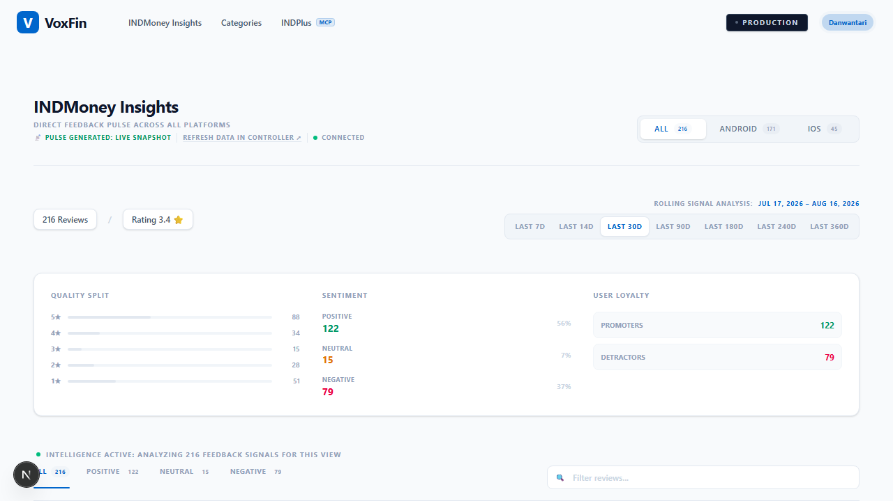
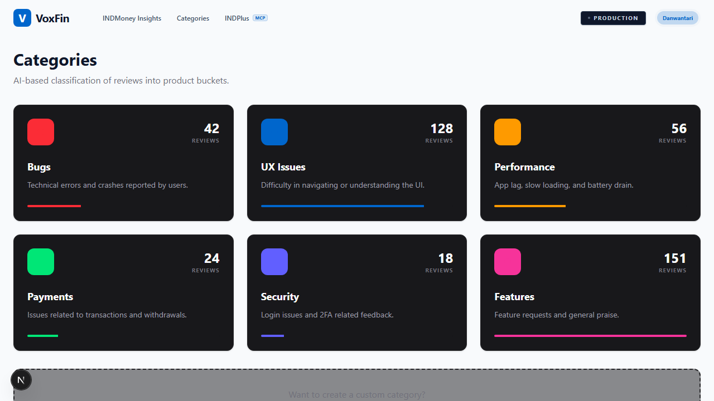
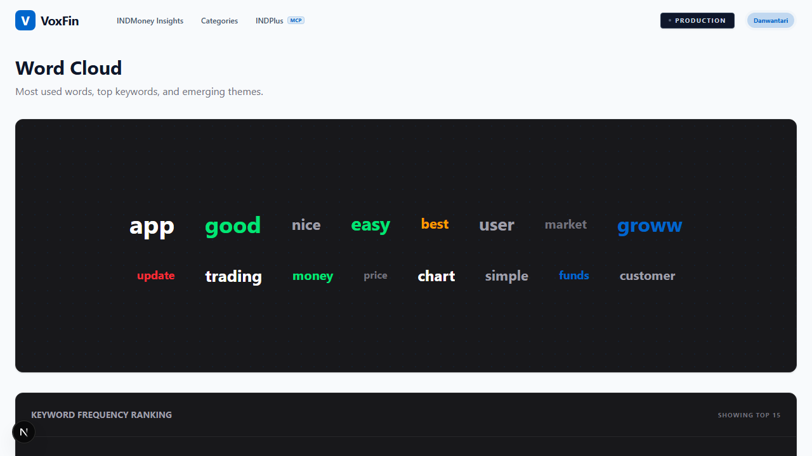
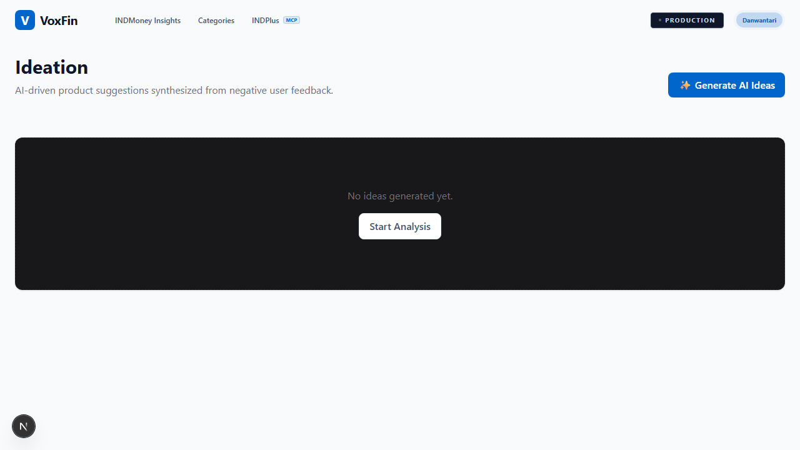
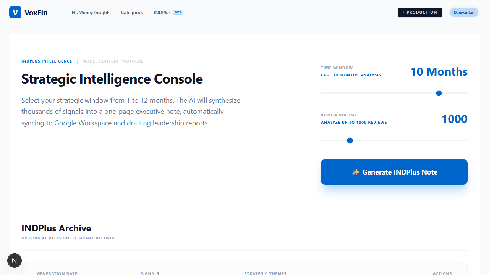
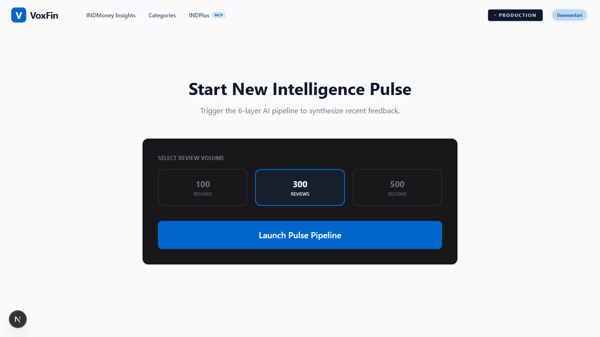
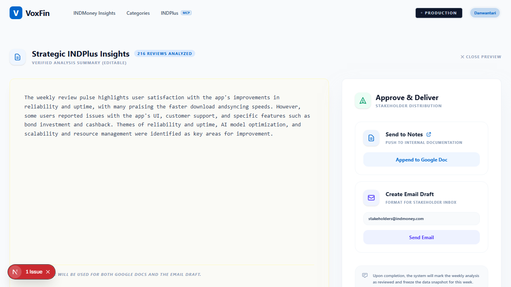
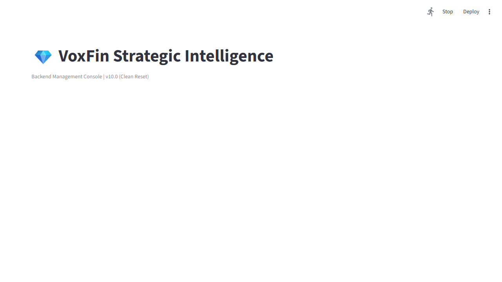

# VoxFin Intelligence — Product Walkthrough & Engineering Journal

This document is a guided tour of the product (with screenshots) and an honest
engineering journal of every real bug that was found while standing this project
up, what caused it, and how it was fixed. It's here so anyone reading the repo —
a reviewer, a hiring manager, or future-me — can see not just the finished
product but the actual debugging trail behind it.

---

## 1. What this is

**VoxFin Intelligence** is a Voice-of-Customer intelligence platform: it ingests
app store reviews, cleans and deduplicates them, uses an LLM (Claude Haiku 4.5)
to extract themes/sentiment/action items, and turns that into three real outputs:

- A **web dashboard** (Next.js) for browsing signals, categories, and generated reports
- **Automated email delivery** of the weekly executive summary (Gmail SMTP)
- **Automated Jira ticket creation** for flagged reviews, routed to the right team

The demo dataset is real INDMoney (fintech) app review data — 216 recent reviews
and a 1,351-report historical archive.

**Stack:** Next.js 16 (Turbopack) + Tailwind v4 on the frontend, Python services
(Anthropic SDK, Jira REST API, Gmail SMTP via `smtplib`) on the backend, Streamlit
as an operator console, SQLite for local storage.

---

## 2. User Journey

### Category Intelligence (home)
Landing page — rolling-window KPIs (total signals, average rating, sentiment
split, promoters/detractors) and a breakdown by functional category (Bugs,
Performance, Payments, etc.), each tagged with a health status (Good / Warning /
Critical / Opportunity) computed from sentiment and volume.

### INDMoney Insights (reviews feed)
The raw review feed — filterable by platform, time window, sentiment, and
category, with full-text search. Clicking a review opens a side drawer to assign
it to a team member, which fires a real Jira ticket via the Jira REST API.

### Categories
A visual breakdown of review volume by product bucket (Bugs, UX Issues,
Performance, Payments, Security, Features), each as a "premium" dark card
showing count and a proportion bar.

### Word Cloud
Keyword frequency across all reviews — a quick lexical view of what users are
actually saying, plus a ranked frequency table.

### Ideation
AI-driven product suggestions synthesized from negative reviews only — surfaces
bug reports and feature ideas a PM could act on directly.

### INDPlus — Strategic Intelligence Console
The "executive" surface: pick a time window (1–12 months) and review volume,
click **Generate INDPlus Note**, and Claude synthesizes a full executive report
from the underlying reviews in seconds. Below it, the full historical archive of
past reports (1,351 entries).

### New Pulse
A simpler, step-by-step trigger for the full 6-layer pipeline (ingest → clean →
discover signals → classify themes → synthesize note → deliver), for when you
want the complete pipeline rather than the fast-path synthesis.

### Individual report
A generated report: executive summary (editable inline), categorized themes with
impact %, proactive financial-education content, verbatim user quotes, and
ranked action items. From here you can push the note to Google Docs or send it
as a real email to stakeholders.

### Streamlit backend console
The operator-facing control panel — configure financial-education targets,
rolling window, and max review capacity, then trigger the full pipeline
end-to-end (ingest → Claude synthesis → PDF → email → Jira).

---

## 3. Engineering journal — every real problem, and the fix

These are listed roughly in the order they were found. Each one was verified
fixed by actually reproducing it (screenshot / log / direct API call), not just
by reading the code.

### 3.1 — LLM provider swap: Groq → Claude
**Ask:** replace Groq (Llama 3.3 70B) with Claude, cost-consciously.
**Change:** every service (`discovery_service`, `classification_service`,
`llm_service`, `note_service`, `fee_explainer_service`, `ideation_service`, the
Phase 1 orchestrator, and the Next.js `fast-synthesis` route) now calls
**Claude Haiku 4.5** — the cheapest current-generation model — via the official
Anthropic SDK, with a small shared helper (`services/anthropic_client.py`) that
replicates the JSON-mode behavior Groq's `response_format` used to provide
(Claude has no native JSON mode, so the helper strips markdown fences and parses
defensively). Verified with a live ping to the Messages API before wiring it
into the pipeline.

### 3.2 — Real email + Jira, not mocked
Both integrations default to a safe mock mode when credentials are absent
(`[SIMULATED] JIRA-1234`, a printed "credentials not configured" message). Once
real credentials were provided, both were verified against the **live APIs**,
not just "the code looks right": an actual email was sent and landed in the
inbox, and an actual Jira ticket (`SCRUM-6`) was created and confirmed via the
Jira REST API (`GET /rest/api/3/project/SCRUM` returned real project metadata).
An early Jira auth failure (`401 Client must be authenticated`) turned out to be
a mismatched account email vs. the token's owning account — fixed by using the
correct login email for that Atlassian site.

### 3.3 — `localhost:8001` port collision → hard crashes
**Symptom:** `/reviews` crashed with `reviews.forEach is not a function`;
`/ideation` crashed with `ideas.map is not a function`.
**Root cause:** both pages had a "local dev fallback" that fetched
`http://localhost:8001/...` as if it were this project's own backend — but no
server in this repo ever binds to that port. On this machine, port 8001 happened
to be occupied by an *entirely unrelated* project, so the fetch "succeeded" and
fed garbage-shaped JSON straight into `setReviews()` / `setIdeas()`, which then
crashed the first time the code called `.forEach()` or `.map()` on it.
**Fix:** validate the shape of anything coming back from that fallback
(`Array.isArray(...)`, expected keys present) before trusting it, on both pages.

### 3.4 — Invisible text: a CSS class that was never defined
**Symptom:** the Categories, Ideation, Word Cloud, New Pulse, and individual
Report pages rendered with white/near-white text on a white page — readable
only by selecting it.
**Root cause:** all five pages use a `.card-premium` class that was referenced
everywhere but **never defined in `globals.css`** — so it resolved to no
background at all, while the text inside assumed a dark card (`text-white`,
`text-zinc-400`).
**Fix:** added the missing `.card-premium` definition (dark card, matching what
the surrounding text colors were clearly designed for). One report-page instance
had the opposite problem — light-themed text with no card override — and was
fixed with an explicit light override to match its siblings.

### 3.5 — Stale Turbopack cache silently ignoring a real fix
After fixing 3.4, the compiled CSS still didn't contain `.card-premium` — the
dev server had a corrupted Turbopack filesystem cache serving an old bundle. A
clean restart surfaced the message *"Turbopack's filesystem cache has been
deleted because we previously detected an internal error"* and resolved it.
Noted here because it's a good instinct: if a fix "isn't showing up" in Next.js
dev mode, check the compiled output directly (`curl` the `.css`/`.js` chunk)
before assuming the fix itself is wrong.

### 3.6 — "undefined" everywhere instead of an empty state
**Symptom:** the home/Category Intelligence page rendered the literal string
`undefined` for every metric when the data source failed.
**Root cause:** `data` was only guarded against being `null` while `loading`
was `true`; once loading finished with `data` still `null`, the page fell
through to the main render and every `data?.summary?.x` access rendered
`undefined` as text.
**Fix:** added a proper empty state for `!loading && !data`, and hardened the
fallback path so it only accepts a response that actually looks like the
expected payload shape (same class of fix as 3.3).

### 3.7 — The real root cause behind most of the above: no pushed repo yet
Several pages fetch their primary data from
`raw.githubusercontent.com/.../data/latest_pulse.json` — which 404s locally
until this repo is actually pushed to GitHub. Rather than leave local dev
broken until then, I added two local API routes,
[`/api/local-pulse`](../phase4/web-ui/app/api/local-pulse/route.js) and
[`/api/local-archive`](../phase4/web-ui/app/api/local-archive/route.js), that
serve the already-present `data/latest_pulse.json` / `data/reports_archive.json`
straight off disk, and wired every page (`/`, `/reviews`, `/reports`,
`/report/[id]`, and the `fast-synthesis` API route used by "Generate INDPlus
Note") to fall back to them. Production (once deployed with the repo live) uses
the GitHub source as originally designed; local dev now works immediately
either way.

### 3.8 — `/api/fetch-archive` throwing a 500 on a non-JSON response
GitHub's raw-content 404 response body is plain text (`"404: Not Found"`), not
JSON — the route was calling `.json()` on it unconditionally, which threw and
surfaced as an unhandled 500. Fixed to check `res.ok` before parsing and return
an empty array on any failure, matching what the client already expected.

### 3.9 — Claude silently never firing on "Generate INDPlus Note"
**Symptom:** clicking Generate produced a *"Fast Synthesis Failed: Syncing..."*
error, and even after fixing 3.7, it silently fell back to a canned placeholder
summary instead of a real one.
**Root cause, part one:** the `fast-synthesis` API route (like 3.7) had no local
fallback for the review data.
**Root cause, part two:** `ANTHROPIC_API_KEY` and the Jira credentials were only
present in the repo-root `.env` — but Next.js only auto-loads env files from its
**own** project directory (`phase4/web-ui`), not a parent folder, so the API
route never actually saw the key and silently skipped straight to its
zero-credential placeholder response.
**Fix:** added the local-file fallback to `fast-synthesis`, and created
`phase4/web-ui/.env.local` (gitignored) with the same credentials. Verified with
a direct API call that the response now contains genuine Claude-generated themes
and verbatim quotes pulled from the real review set, not placeholder text.

---

## 4. Why this is worth reading as a portfolio piece

Every fix above was **verified against the running system** — a live API call,
a screenshot, a server log — not assumed correct because the diff looked
reasonable. That loop (reproduce → root-cause → fix → re-verify) is the same one
this repo's own `docs/screenshots/` were captured through.
